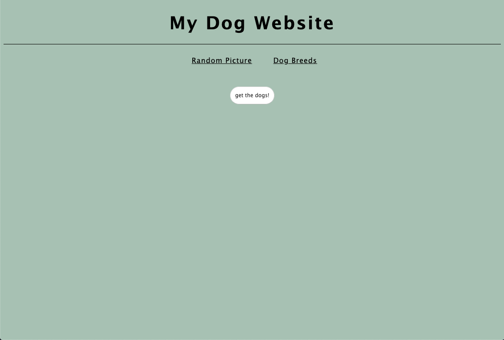
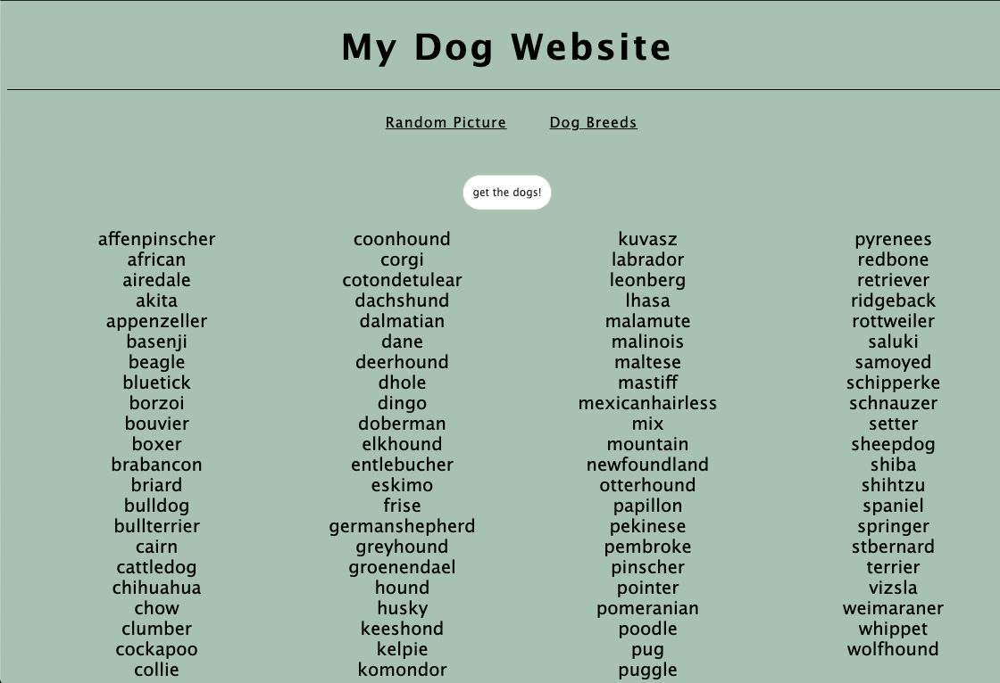
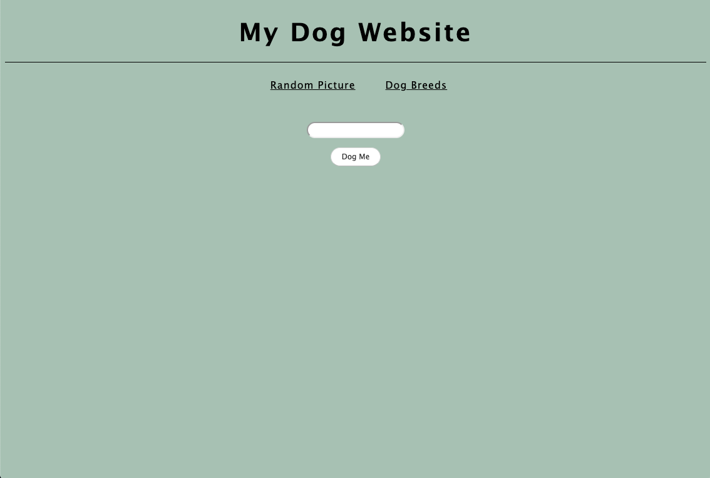
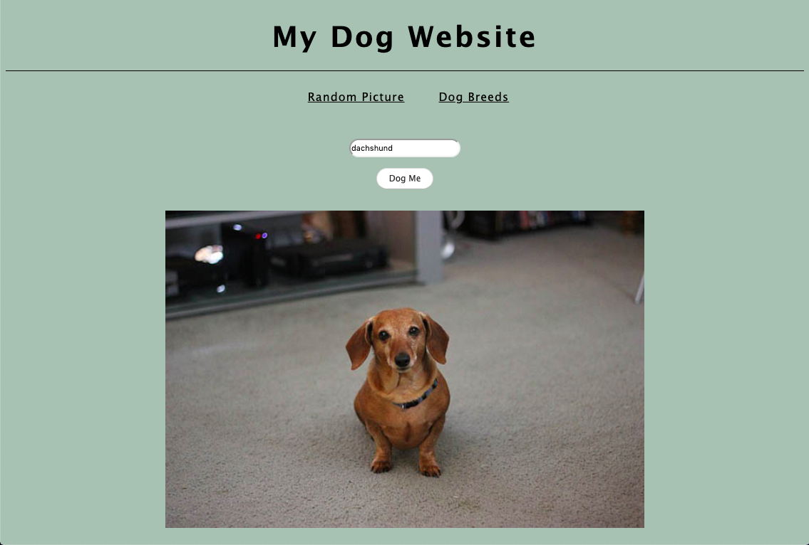

# Using the Dog API

## Overview
We've added a new view to the dog API app from today's lesson. The new page will make an API call to get **all the breeds** available from the dog API.

## Instructions
For this lab, you will need to write out the axios call to the dog API inside the file `/js/breed.js`. The endpoint that you need to hit is `https://dog.ceo/api/breeds/list/all`. It is SO important that you put `https` at the beginning of your URL for this API.  If you do not put the "S", the call may fail. Once you have finished the axios call and you can get dog breeds to show in the DOM, then you will need to style the app.

### Please make your site look as similar as possible to these mock-ups.

### BONUS: Use a CSS animation - be creative!

## Resources
- [Intro to APIs](https://github.com/SEI-R-7-26/u1_lesson_intro_to_APIs)
- [Redhat: APIs](https://www.redhat.com/en/topics/api/what-are-application-programming-interfaces)
- [Axios](https://github.com/axios/axios)
